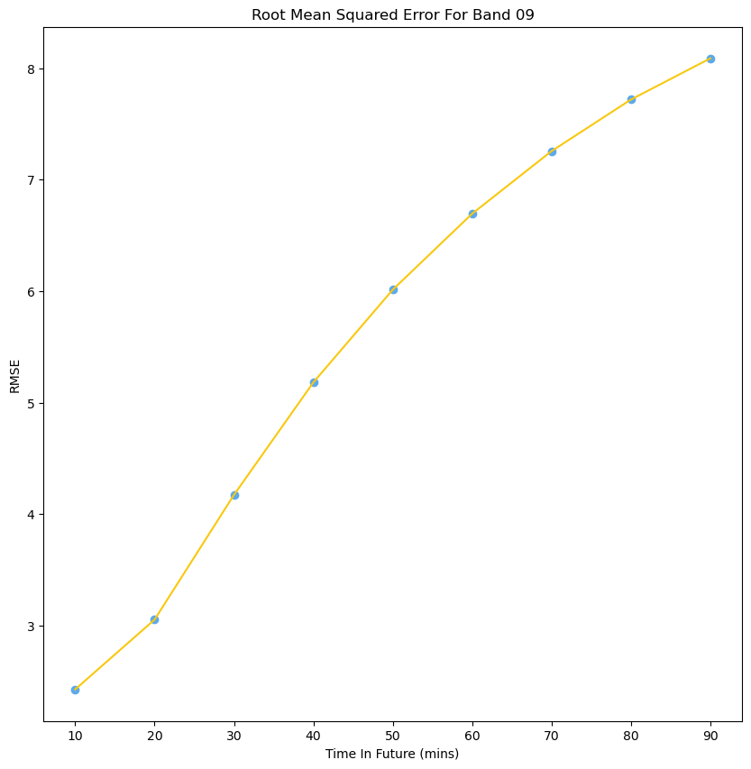

# Lumo: AI Weather Prediction

### The objective of Lumo is to create a machine learning system for predicting precipitation and weather patterns in a quick and accurate manner, using fewer computing resources than traditional numerical methods. Lumo’s machine learning models will be trained based primarily on satellite imagery and doppler radar data, allowing for greater consistency in data availability. This system should be able to accurately predict the short term weather forecast and extrapolate the data to get longer term predictions.  
----
###  Each satellite image is taken from the [GOES-16 satellite](https://www.star.nesdis.noaa.gov/GOES/fulldisk.php?sat=G16), taken at a specific wavelength, representing a certain depth in the atmosphere. Generally, the lower the temperature, the more signficant the weather data is in the image.   Predictions are made using Deepmind's pretrained model [source](https://www.nature.com/articles/s41586-021-03854-z) which is a GAN network using a Deep Generative Model for Rainfall for generation. This model was trained only on radar imagery in the UK, so this project is transferring this model to GOES-16 satellite and Canadian Multi-Radar Multi-Sensor (MRMS) radar imagery.   

# Weather Forecast
### We generate a weather forecast from the 11.6 µm Longwave IR Window Band. We will output 3 states: cloudy, partly cloudy or sunny. We also generate a prediction for rainfall from the RMSE images. This appears as a Probability of Precipitation (0% for 0 mm)  
  

# Example Predictions

### Below are examples of GOES-16 forecasts cenetered around the region of Waterloo. The associated plot represents the Root Mean Squared Error (RMSE) and is calculated between each pixel in the prediction and ground truth images. Each data point represents how many degrees Celcius each pixel in the prediction is off from the ground truth, on average.  

# "Shortwave Window" Band - 3.9 µm
### 2 km resolution - The 3.9 μm band can be used to identify fog and low clouds at night, identify fire hot spots, detect volcanic ash, estimate sea-surface temperatures, and discriminate between ice crystal sizes during the day. Low-level atmospheric vector winds can be estimated with this band.
## Ground Truth

## Lumo Prediction

## Root Mean Squared Error

  

# Upper-level Water Vapor - 6.2 µm
### 2 km resolution - Upper-level tropospheric water vapor tracking, jet stream identification, hurricane track forecasting, mid-latitude storm forecasting, severe weather analysis, upper mid-level moisture estimation and turbulence detection.
## Ground Truth

## Lumo Prediction

## Root Mean Squared Error

  

# "Mid-level Water Vapor" Band - 6.9 µm
### 2 km resolution - This water vapor band is the mid-level water vapor band. It is used for tracking middle-tropospheric winds, identifying jet streams, forecasting hurricane track and mid-latitude storm motion, monitoring severe weather potential, estimating mid-level moisture

## Lumo Prediction

## Root Mean Squared Error

  

# Lower-level Water Vapor - 7.3 µm
### 2 km resolution - This water vapor band typically senses farthest down into the midtroposphere in cloud-free regions, to around 500-750 hPa. It is used to track lowertropospheric winds and identify jet streaks.

## Lumo Prediction

## Root Mean Squared Error

  

# "Clean" Longwave IR Window Band - 10.3 µm
### 2 km resolution - Band 13 at 10.3 µm is an infrared window, meaning it is not strongly affected by atmospheric water vapor. This channel is useful for detecting clouds all times of day and night and is particularly useful in retrievals of cloud top height. 
## Ground Truth

## Lumo Prediction

## Root Mean Squared Error

  

# Longwave IR Window Band - 11.6 µm
### 2 km resolution - The traditional longwave infrared window band, is used to diagnose discrete clouds and organized features for general weather forecasting, analysis, and broadcasting applications. Observations from this IR window channel characterize atmospheric processes associated with extratropical cyclones and also in single thunderstorms and convective complexes.
## Ground Truth

## Lumo Prediction

## Root Mean Squared Error

  

